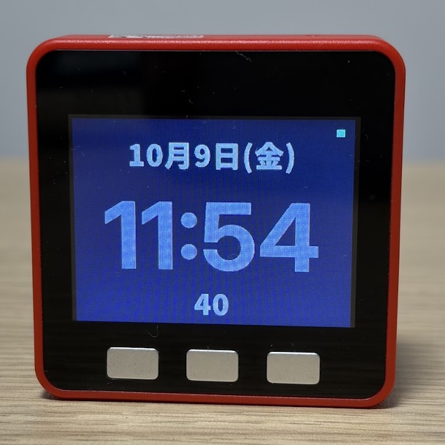

# m5clock

M5Stack Fire上で動作する、[TinyGo](https://tinygo.org/)製のNTP時計です。

Wi-Fiに接続してDHCPでIPアドレスを取得し、DNSでNTPサーバーを名前解決して時刻を同期します。同期した時刻はTinyGoの`runtime.AdjustTimeOffset`でシステム時刻に反映し、M5Stack Fireの320×240 LCDに表示します。

ネットワーク処理には[espradio](https://github.com/tinygo-org/espradio)と[lneto](https://github.com/soypat/lneto)を使用しています。



## Features

- Wi-Fi / DHCP / DNS / NTPによる時刻同期
- `runtime.AdjustTimeOffset`によるシステム時刻の補正
- 日本語の日付、大きな時刻表示、秒表示
- 変更された領域だけを更新する差分描画
- 同期状態を示すカラードット
- 同期完了後にWi-Fiを停止し、6時間後に再同期
- ネットワーク接続に失敗しても時計表示を継続
- ホストPC上で実行できるユニットテスト

## Requirements

- M5Stack Fire（ESP32）
- 2.4 GHz帯のWi-Fiアクセスポイント
- Go
- TinyGoの開発版

動作確認には次のTinyGoを使用しました。

```text
tinygo version 0.43.0-dev-f6d269f7 darwin/arm64
(using go version go1.27.1 and LLVM version 22.1.4)
```

TinyGo 0.42.0ではWi-Fi接続に失敗するため、修正が含まれる2026年10月以降の開発版を使用してください。上記のバージョンで動作を確認しています。

依存ライブラリのバージョンは`go.mod`で指定しており、ローカルの`replace`や独自パッチは不要です。

## Build and Flash

TinyGoの開発版を`tinygo-dev`という名前で実行できる場合、次のコマンドでM5Stack Fireに書き込めます。

```sh
tinygo-dev flash -target=m5stack \
  -ldflags="-X main.ssid=YOUR_SSID -X main.password=YOUR_PASSWORD -X main.timezone=+09:00" \
  .
```

`YOUR_SSID`と`YOUR_PASSWORD`を使用するWi-Fiの認証情報に置き換えてください。

`timezone`にはUTCからの固定オフセットを`+09:00`や`-05:30`の形式で指定します。省略するとUTCになります。IANAタイムゾーン名や夏時間には対応していません。

**Wi-Fiの認証情報はビルド時にバイナリへ埋め込まれます。** 認証情報を含むバイナリを公開しないでください。また、コマンドラインに指定した認証情報がシェル履歴などに残ることにも注意してください。

### Serial output

`-monitor`を付けると、Wi-Fi接続からNTP同期までのログを確認できます。

```sh
tinygo-dev flash -target=m5stack -monitor \
  -ldflags="-X main.ssid=YOUR_SSID -X main.password=YOUR_PASSWORD -X main.timezone=+09:00" \
  .
```

正常に同期できた場合は、次のようなログが出力されます。

```text
initializing radio...
connecting WiFi...
requesting DHCP lease...
IP: 192.168.x.x
resolving pool.ntp.org
NTP candidate: ...
NTP success: ...
time synchronized: ...
stopping radio...
radio stopped
```

## How It Works

### Network and time synchronization

時刻同期は次の順序で実行します。

```text
Wi-Fi接続 (espradio)
    |
    v
DHCPでIPアドレス取得 (lneto)
    |
    v
DNSでpool.ntp.orgを名前解決 (lneto)
    |
    v
UDPでNTP問い合わせ (lneto)
    |
    v
runtime.AdjustTimeOffset
    |
    v
Wi-Fi停止 (espradio)
    |
    v
6時間待機後に再同期
```

ESP32のWi-Fi制御には`espradio`を使用し、IP、UDP、DHCP、DNS、NTPの処理には`lneto`を使用します。

DNSから複数のIPアドレスが返された場合、取得した候補を順に試してNTP同期を行います。

時刻同期に失敗した場合は、30秒から最大5分までの指数バックオフで再試行します。

### Timekeeping

NTPから得られた時刻との差分を`runtime.AdjustTimeOffset`に渡し、TinyGoのシステム時刻を補正します。

LCDの描画処理は`time.Now()`を参照するため、ネットワーク処理とは独立して動作します。時刻同期に失敗しても時計の表示は継続します。

### Display

320×240のLCDに、日付、時刻、秒、同期状態を表示します。

毎秒画面全体を再描画せず、表示が変化した領域だけを更新します。通常は秒表示だけを更新し、分や日付が変わった場合に対応する領域も描画します。

描画と時刻同期は別々のgoroutineで動作し、同期状態の変化は型付きchannelを通じてUIへ通知します。

## Development

ホストPC上では、実機を接続せずにアプリケーション状態や描画処理のユニットテストを実行できます。

```sh
go test ./...
go vet ./...
```

TinyGoでもテストを実行できます。

```sh
tinygo-dev test ./...
```

golangci-lintを使用する場合は、次のコマンドで静的解析を実行できます。

```sh
golangci-lint run ./...
```

通常のGoツールによる検査では、`m5stack`ビルドタグで分離された実機固有コードは対象になりません。実機向けコードのコンパイル確認にはTinyGoを使用してください。

```sh
tinygo-dev build -target=m5stack -size=short .
```

### Source layout

| File | Description |
|---|---|
| `main_m5stack.go` | M5Stack Fireの初期化 |
| `timesync_m5stack.go` | Wi-Fi、DHCP、DNS、NTP、時刻同期 |
| `app.go` | アプリケーション状態と時刻表示の生成 |
| `ui.go` | UIイベントループ |
| `render.go` | LCD描画と差分更新 |
| `colorfont.go` | アンチエイリアスフォントの描画 |
| `inter_clock_105.go` | 時計表示用の生成済みフォント |
| `japanese_date_32.go` | 日付・秒表示用の生成済みフォント |

主な設計判断については[Design Notes](docs/design.md)を参照してください。

## Fonts

時計表示には[Inter](https://github.com/rsms/inter)、日付表示には[Noto Sans JP](https://github.com/notofonts/noto-cjk)を使用しています。

TinyGoで利用するため、必要な文字だけを2bitアンチエイリアスのビットマップフォントに変換し、Goのソースコードとして組み込んでいます。

生成済みの`inter_clock_105.go`と`japanese_date_32.go`はリポジトリに含まれているため、通常のビルドでは元フォントやフォント生成ツールをインストールする必要はありません。

### Regenerating the fonts

時計表示用フォントは、Inter Variable Fontから`fonttools`でweight=700、optical size=32の静的フォントを生成します。

```sh
fonttools varLib.instancer \
  fonts/Inter-VariableFont_opsz,wght.ttf \
  wght=700 opsz=32 \
  --output fonts/InterClock-700-32.ttf
```

続いて、`tinyfontgen-ttf`で数字とコロンを抽出します。

```sh
tinyfontgen-ttf \
  --size 105 --dpi 75 \
  --ascii=false --string "0123456789:" \
  --package main --fontname InterClock105 \
  --output inter_clock_105.go \
  fonts/InterClock-700-32.ttf
```

日付表示用フォントはNoto Sans JPから生成します。

```sh
tinyfontgen-ttf \
  --size 32 --dpi 75 \
  --ascii=false --string "0123456789月火水木金土日()" \
  --package main --fontname JapaneseDate32 \
  --output japanese_date_32.go \
  fonts/NotoSansJP-Black.otf
```

これらのコマンドはフォント原本を別途入手し、`fonts/`に配置した状態で実行します。フォント原本と中間生成物はリポジトリに含めていません。

フォントの利用条件は下記の[License](#license)を参照してください。

## Known Limitations

- 動作確認したハードウェアはM5Stack Fireです。
- 現時点ではTinyGoの開発版が必要です。
- Wi-Fi認証情報はビルド時に設定します。
- タイムゾーンは固定UTCオフセットのみ対応しています。
- 初回のWi-Fi接続、NTP同期、無線停止は10回連続で成功することを確認しました。6時間後の再同期を含む長時間動作は十分に検証していません。

## Related Projects

- [TinyGo](https://tinygo.org/) — Goによるマイコン向けプログラムのコンパイル
- [espradio](https://github.com/tinygo-org/espradio) — ESP32のWi-Fi制御
- [lneto](https://github.com/soypat/lneto) — 組み込み向けネットワークスタック
- [TinyGo Drivers](https://github.com/tinygo-org/drivers) — LCDなどのデバイスドライバ
- [tinyfont](https://github.com/tinygo-org/tinyfont) — ビットマップフォント描画

この時計の開発中に、DNS処理やESP32のWi-Fi初期化に関する問題が見つかり、依存ライブラリの改善にも取り組みました。

## License

このリポジトリの独自実装コードは[MIT License](LICENSE)で公開しています。

ただし、以下の生成済みフォントデータには第三者が著作権を保有するフォントに由来するデータが含まれており、MIT Licenseではなく、それぞれの元フォントのライセンスが適用されます。

| File | Original font | License |
|---|---|---|
| `inter_clock_105.go` | [Inter](https://github.com/rsms/inter) | SIL Open Font License 1.1 |
| `japanese_date_32.go` | [Noto Sans JP](https://github.com/notofonts/noto-cjk) | SIL Open Font License 1.1 |

各フォントの著作権表示およびライセンス条件については、同梱するライセンス文書を参照してください。

- `licenses/Inter-OFL.txt`
- `licenses/NotoSansJP-OFL.txt`

これらのファイルには、それぞれ使用した元フォントの配布物に含まれる著作権表示とSIL Open Font Licenseの本文を収録します。

依存する外部ライブラリには、それぞれのライセンスが適用されます。
